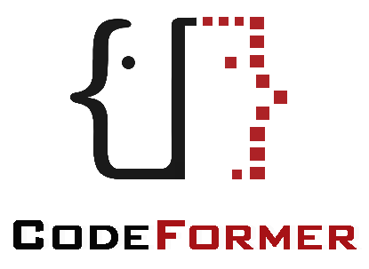
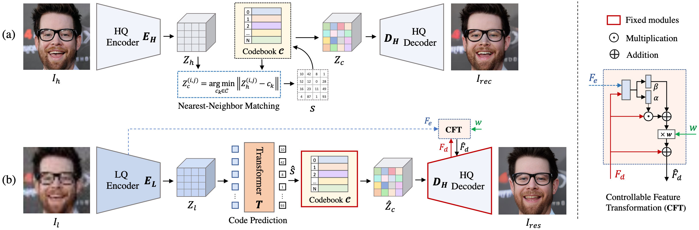
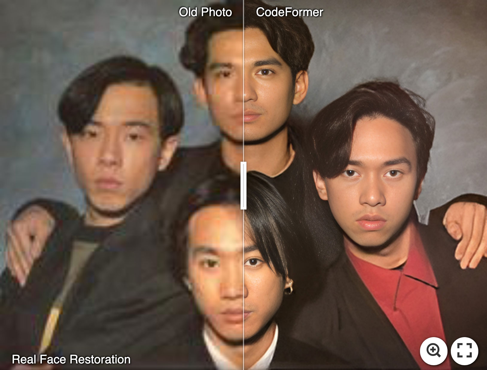
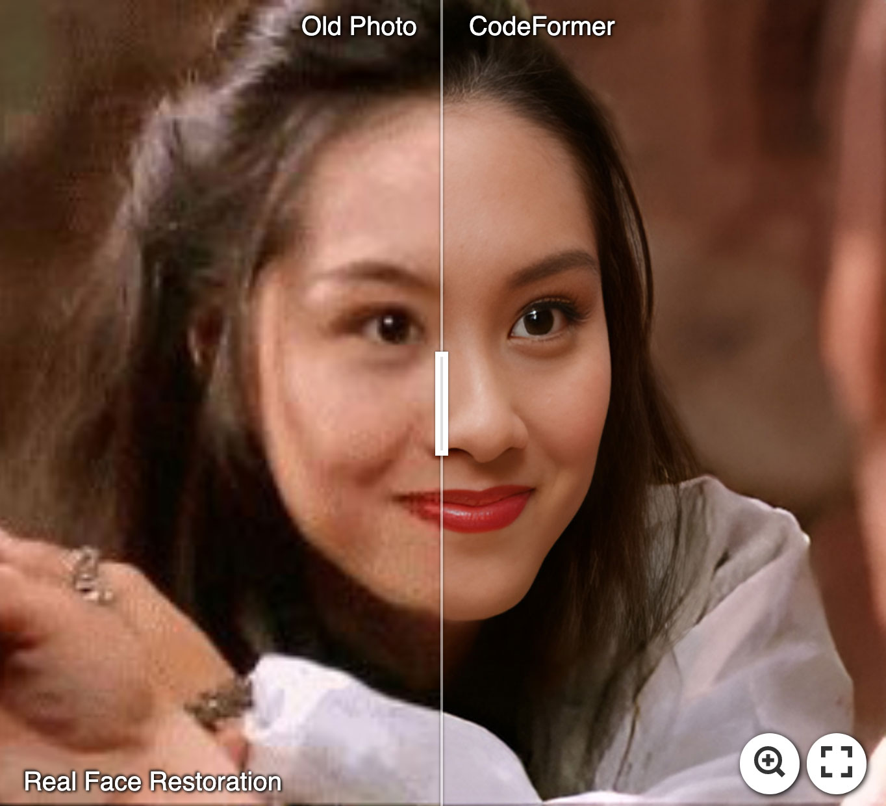
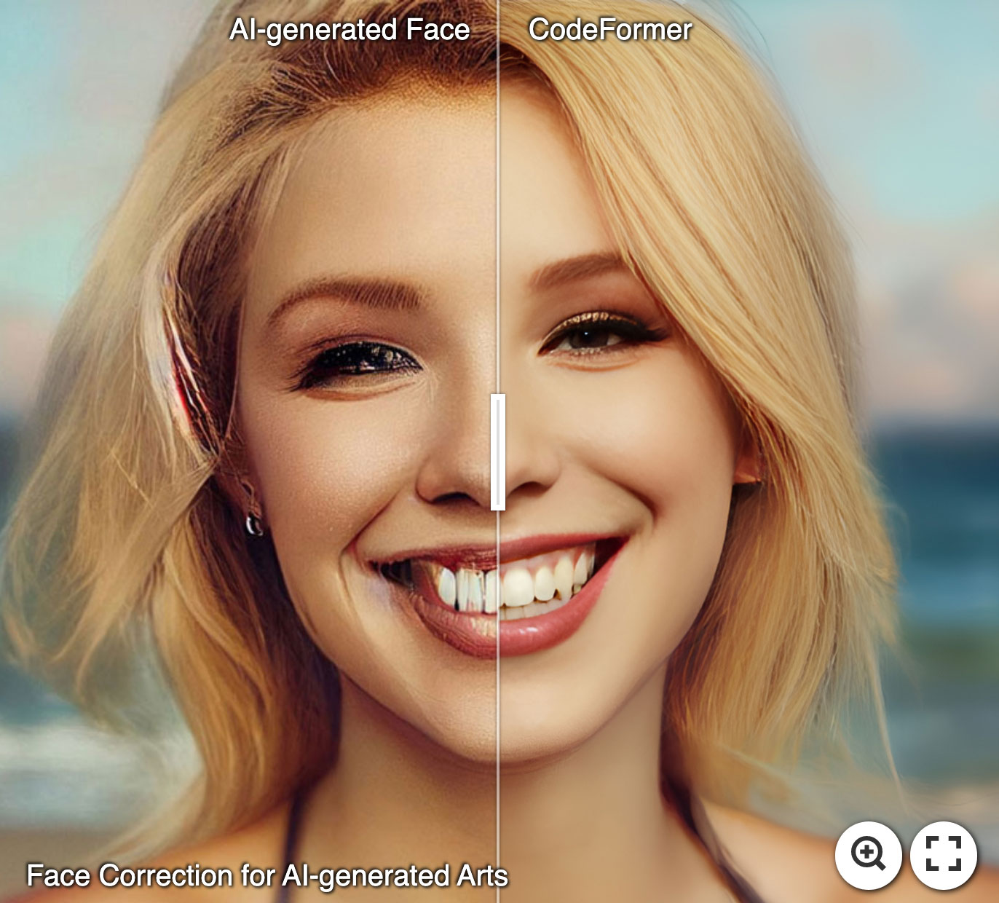
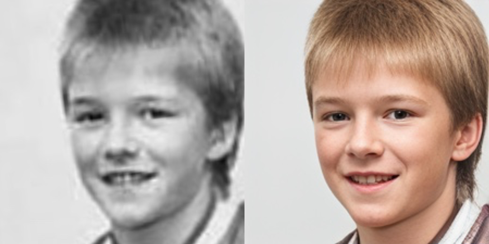
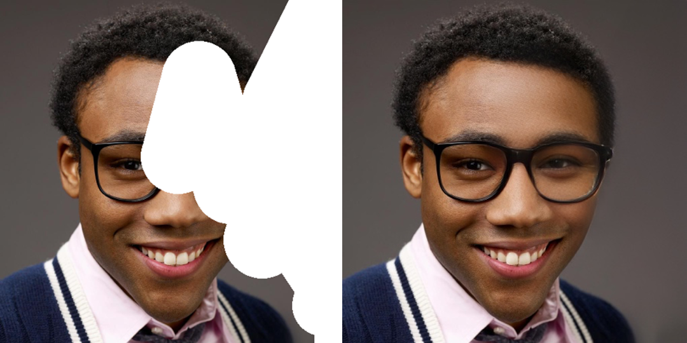
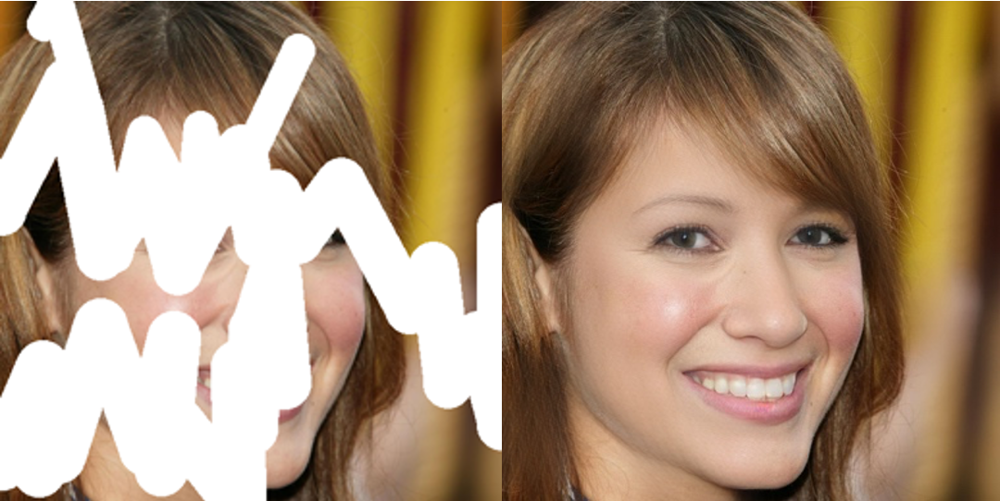

<p align="center">
  
</p>

## Towards Robust Blind Face Restoration with Codebook Lookup Transformer (NeurIPS 2022)

[Paper](https://arxiv.org/abs/2206.11253) | [Project Page](https://shangchenzhou.com/projects/CodeFormer/) | [Video](https://youtu.be/d3VDpkXlueI)


<a href="https://colab.research.google.com/drive/1m52PNveE4PBhYrecj34cnpEeiHcC5LTb?usp=sharing"></a> [](https://huggingface.co/spaces/sczhou/CodeFormer) [](https://replicate.com/sczhou/codeformer) [](https://openxlab.org.cn/apps/detail/ShangchenZhou/CodeFormer) 


[Shangchen Zhou](https://shangchenzhou.com/), [Kelvin C.K. Chan](https://ckkelvinchan.github.io/), [Chongyi Li](https://li-chongyi.github.io/), [Chen Change Loy](https://www.mmlab-ntu.com/person/ccloy/) 

S-Lab, Nanyang Technological University




:star: If CodeFormer is helpful to your images or projects, please help star this repo. Thanks! :hugs: 


### Update
- **2023.07.20**: Integrated to :panda_face: [OpenXLab](https://openxlab.org.cn/apps). Try out online demo! [](https://openxlab.org.cn/apps/detail/ShangchenZhou/CodeFormer)
- **2023.04.19**: :whale: Training codes and config files are public available now.
- **2023.04.09**: Add features of inpainting and colorization for cropped and aligned face images.
- **2023.02.10**: Include `dlib` as a new face detector option, it produces more accurate face identity.
- **2022.10.05**: Support video input `--input_path [YOUR_VIDEO.mp4]`. Try it to enhance your videos! :clapper: 
- **2022.09.14**: Integrated to :hugs: [Hugging Face](https://huggingface.co/spaces). Try out online demo! [](https://huggingface.co/spaces/sczhou/CodeFormer)
- **2022.09.09**: Integrated to :rocket: [Replicate](https://replicate.com/explore). Try out online demo! [](https://replicate.com/sczhou/codeformer)
- [**More**](docs/history_changelog.md)

### TODO
- [x] Add training code and config files
- [x] Add checkpoint and script for face inpainting
- [x] Add checkpoint and script for face colorization
- [x] ~~Add background image enhancement~~

#### :panda_face: Try Enhancing Old Photos / Fixing AI-arts
[](https://imgsli.com/MTI3NTE2) [](https://imgsli.com/MTI3NTE1) [](https://imgsli.com/MTI3NTIw) 

#### Face Restoration

 
 

#### Face Color Enhancement and Restoration

 

#### Face Inpainting

 


### Dependencies and Installation

- Pytorch >= 1.7.1
- CUDA >= 10.1
- Other required packages in `requirements.txt`
```
# git clone this repository
git clone https://github.com/sczhou/CodeFormer
cd CodeFormer

# create new anaconda env
conda create -n codeformer python=3.8 -y
conda activate codeformer

# install python dependencies
pip3 install -r requirements.txt
python basicsr/setup.py develop
conda install -c conda-forge dlib (only for face detection or cropping with dlib)
```
<!-- conda install -c conda-forge dlib -->

### Quick Inference

#### Download Pre-trained Models:
Download the facelib and dlib pretrained models from [[Releases](https://github.com/sczhou/CodeFormer/releases/tag/v0.1.0) | [Google Drive](https://drive.google.com/drive/folders/1b_3qwrzY_kTQh0-SnBoGBgOrJ_PLZSKm?usp=sharing) | [OneDrive](https://entuedu-my.sharepoint.com/:f:/g/personal/s200094_e_ntu_edu_sg/EvDxR7FcAbZMp_MA9ouq7aQB8XTppMb3-T0uGZ_2anI2mg?e=DXsJFo)] to the `weights/facelib` folder. You can manually download the pretrained models OR download by running the following command:
```
python scripts/download_pretrained_models.py facelib
python scripts/download_pretrained_models.py dlib (only for dlib face detector)
```

Download the CodeFormer pretrained models from [[Releases](https://github.com/sczhou/CodeFormer/releases/tag/v0.1.0) | [Google Drive](https://drive.google.com/drive/folders/1CNNByjHDFt0b95q54yMVp6Ifo5iuU6QS?usp=sharing) | [OneDrive](https://entuedu-my.sharepoint.com/:f:/g/personal/s200094_e_ntu_edu_sg/EoKFj4wo8cdIn2-TY2IV6CYBhZ0pIG4kUOeHdPR_A5nlbg?e=AO8UN9)] to the `weights/CodeFormer` folder. You can manually download the pretrained models OR download by running the following command:
```
python scripts/download_pretrained_models.py CodeFormer
```

#### Prepare Testing Data:
You can put the testing images in the `inputs/TestWhole` folder. If you would like to test on cropped and aligned faces, you can put them in the `inputs/cropped_faces` folder. You can get the cropped and aligned faces by running the following command:
```
# you may need to install dlib via: conda install -c conda-forge dlib
python scripts/crop_align_face.py -i [input folder] -o [output folder]
```


#### Testing:
[Note] If you want to compare CodeFormer in your paper, please run the following command indicating `--has_aligned` (for cropped and aligned face), as the command for the whole image will involve a process of face-background fusion that may damage hair texture on the boundary, which leads to unfair comparison.

Fidelity weight *w* lays in [0, 1]. Generally, smaller *w* tends to produce a higher-quality result, while larger *w* yields a higher-fidelity result. The results will be saved in the `results` folder.


🧑🏻 Face Restoration (cropped and aligned face)
```
# For cropped and aligned faces (512x512)
python inference_codeformer.py -w 0.5 --has_aligned --input_path [image folder]|[image path]
```

:framed_picture: Whole Image Enhancement
```
# For whole image
# Add '--bg_upsampler realesrgan' to enhance the background regions with Real-ESRGAN
# Add '--face_upsample' to further upsample restorated face with Real-ESRGAN
python inference_codeformer.py -w 0.7 --input_path [image folder]|[image path]
```

:clapper: Video Enhancement
```
# For Windows/Mac users, please install ffmpeg first
conda install -c conda-forge ffmpeg
```
```
# For video clips
# Video path should end with '.mp4'|'.mov'|'.avi'
python inference_codeformer.py --bg_upsampler realesrgan --face_upsample -w 1.0 --input_path [video path]
```

🌈 Face Colorization (cropped and aligned face)
```
# For cropped and aligned faces (512x512)
# Colorize black and white or faded photo
python inference_colorization.py --input_path [image folder]|[image path]
```

🎨 Face Inpainting (cropped and aligned face)
```
# For cropped and aligned faces (512x512)
# Inputs could be masked by white brush using an image editing app (e.g., Photoshop) 
# (check out the examples in inputs/masked_faces)
python inference_inpainting.py --input_path [image folder]|[image path]
```
### Training:
The training commands can be found in the documents: [English](docs/train.md) **|** [简体中文](docs/train_CN.md).

### License

This project is licensed under <a rel="license" href="https://github.com/sczhou/CodeFormer/blob/master/LICENSE">NTU S-Lab License 1.0</a>. Redistribution and use should follow this license.

---
### 🐼 Ecosystem Applications & Deployments

CodeFormer has been widely adopted and deployed across a broad range (>20) of online applications, platforms, API services, and independent websites, and has also been integrated into many open-source projects and toolkits.

> Only demos on **Hugging Face Space**, **Replicate**, and **OpenXLab** are official deployments **maintained by the authors**. All other demos, APIs, apps, websites, and integrations listed below are **third-party (non-official)** and are not affiliated with the CodeFormer authors. Please verify their legitimacy to avoid potential financial loss.


#### Websites (Non-official)

⚠️⚠️⚠️ The following websites are **not official and are not operated by us**. They use our models without any license or authorization. Please verify their legitimacy to avoid potential financial loss.


| Website | Link | Notes |
|---------|------|--------|
| CodeFormer.net | https://codeformer.net/ | Non-official website |
| CodeFormer.cn | https://www.codeformer.cn/ | Non-official website |
| CodeFormerAI.com | https://codeformerai.com/ | Non-official website |

#### Online Demos / API Platforms

| Platform | Link | Notes |
|----------|------|--------|
| Hugging Face | https://huggingface.co/spaces/sczhou/CodeFormer | Maintained by Authors |
| Replicate | https://replicate.com/sczhou/codeformer | Maintained by Authors |
| OpenXLab | https://openxlab.org.cn/apps/detail/ShangchenZhou/CodeFormer |Maintained by Authors |
| Segmind | https://www.segmind.com/models/codeformer | Non-official |
| Sieve | https://www.sievedata.com/functions/sieve/codeformer | Non-official |
| Fal.ai | https://fal.ai/models/fal-ai/codeformer | Non-official |
| VaikerAI | https://vaikerai.com/sczhou/codeformer | Non-official |
| Scade.pro | https://www.scade.pro/processors/lucataco-codeformer | Non-official |
| Grandline | https://www.grandline.ai/model/codeformer | Non-official |
| AI Demos | https://aidemos.com/tools/codeformer | Non-official |
| Synexa | https://synexa.ai/explore/sczhou/codeformer | Non-official |
| RentPrompts | https://rentprompts.ai/models/Codeformer | Non-official |
| ElevaticsAI | https://elevatics.ai/models/super-resolution/codeformer | Non-official |
| Anakin.ai | https://anakin.ai/apps/codeformer-online-face-restoration-by-codeformer-19343 | Non-official |
| Relayto | https://relayto.com/explore/codeformer-yf9rj8kwc7zsr | Non-official |


#### Open-Source Projects & Toolkits

| Project / Toolkit | Link | Notes |
|-------------------|------|--------|
| Stable Diffusion GUI | https://nmkd.itch.io/t2i-gui | Integration |
| Stable Diffusion WebUI | https://github.com/AUTOMATIC1111/stable-diffusion-webui | Integration |
| ChaiNNer | https://github.com/chaiNNer-org/chaiNNer | Integration |
| PyPI | https://pypi.org/project/codeformer/ ; https://pypi.org/project/codeformer-pip/ | Python packages |
| ComfyUI | https://stable-diffusion-art.com/codeformer/ | Integration |

---
### Acknowledgement

This project is based on [BasicSR](https://github.com/XPixelGroup/BasicSR). Some codes are brought from [Unleashing Transformers](https://github.com/samb-t/unleashing-transformers), [YOLOv5-face](https://github.com/deepcam-cn/yolov5-face), and [FaceXLib](https://github.com/xinntao/facexlib). We also adopt [Real-ESRGAN](https://github.com/xinntao/Real-ESRGAN) to support background image enhancement. Thanks for their awesome works.

### Citation
If our work is useful for your research, please consider citing:

    @inproceedings{zhou2022codeformer,
        author = {Zhou, Shangchen and Chan, Kelvin C.K. and Li, Chongyi and Loy, Chen Change},
        title = {Towards Robust Blind Face Restoration with Codebook Lookup TransFormer},
        booktitle = {NeurIPS},
        year = {2022}
    }


### Contact
If you have any questions, please feel free to reach me out at `shangchenzhou@gmail.com`. 
